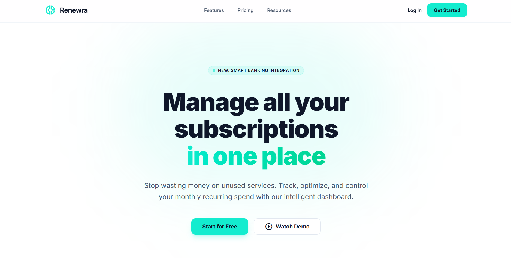
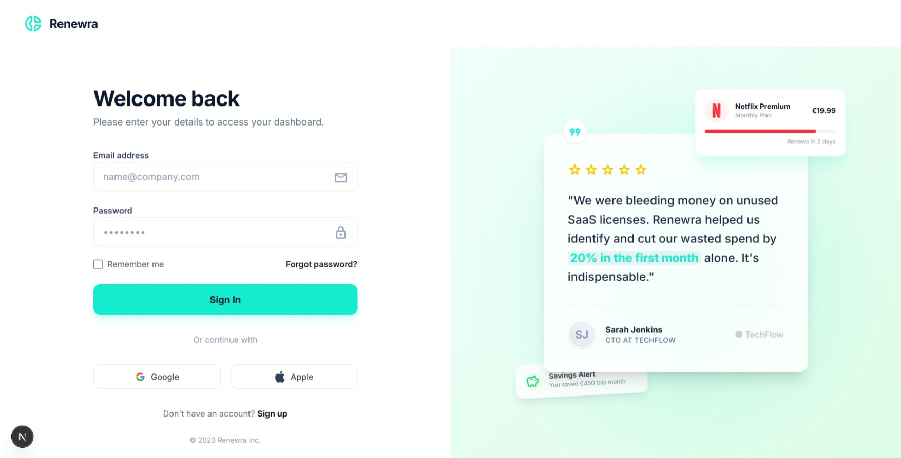
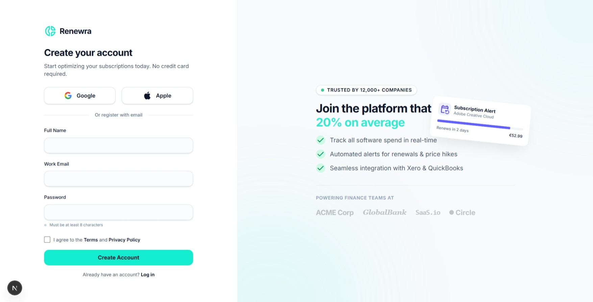
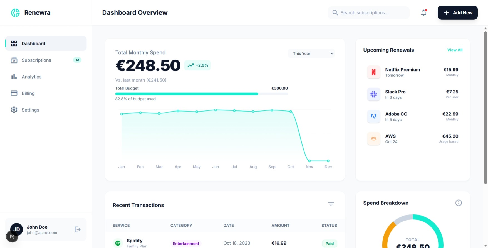
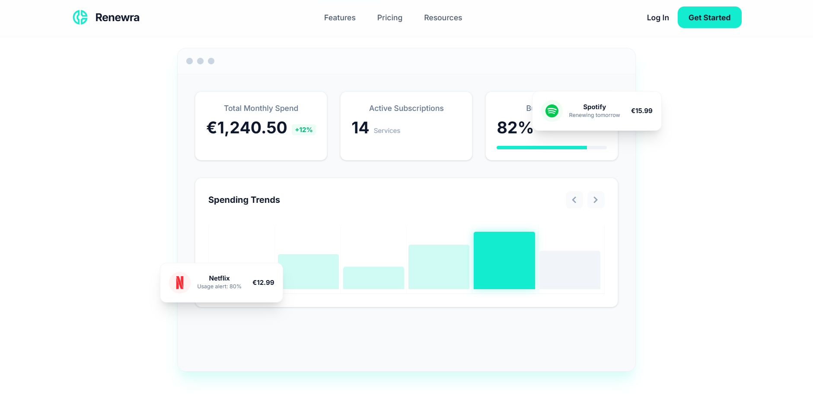
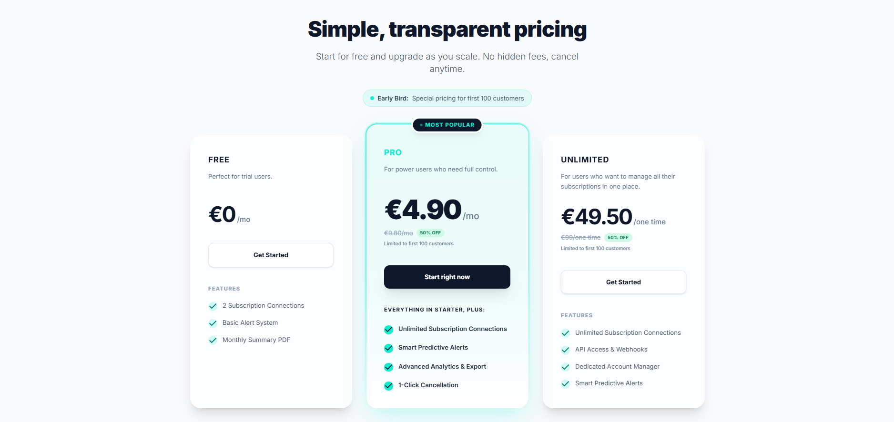
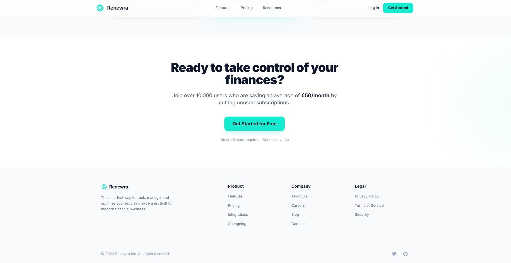

# Renewra - Subscription Management Platform

A modern, beautiful SaaS landing page for managing subscriptions. Built with Next.js 16, React 19, and Tailwind CSS.


## 📸 Screenshots

### Hero Section


### Login Page


### Register Page


### Dashboard


### Dashboard & Analytics


### Pricing Plans


### Footer


## ✨ Features

- 🎨 **Modern UI/UX** - Beautiful, responsive design with glassmorphism effects
- 🎭 **Smooth Animations** - Powered by Framer Motion for delightful user experience
- 📱 **Fully Responsive** - Works seamlessly on all devices
- 🎯 **Component-Based** - Modular React components for easy maintenance
- ⚡ **Performance Optimized** - Built with Next.js 16 for optimal performance
- 🎨 **Custom Design System** - Tailwind CSS with custom color palette and utilities

## 🚀 Tech Stack

- **Framework**: [Next.js 16](https://nextjs.org/)
- **UI Library**: [React 19](https://react.dev/)
- **Styling**: [Tailwind CSS 4](https://tailwindcss.com/)
- **Animations**: [Framer Motion](https://www.framer.com/motion/)
- **Icons**: [Material Symbols](https://fonts.google.com/icons) & [Simple Icons](https://simpleicons.org/)
- **Language**: [TypeScript](https://www.typescriptlang.org/)
- **Font**: [Inter](https://fonts.google.com/specimen/Inter)

## 📦 Installation

1. Clone the repository:
```bash
git clone https://github.com/yourusername/renewra.git
cd renewra
```

2. Install dependencies:
```bash
npm install
# or
yarn install
# or
pnpm install
```

3. Run the development server:
```bash
npm run dev
# or
yarn dev
# or
pnpm dev
```

4. Open [http://localhost:3000](http://localhost:3000) in your browser.

## 🏗️ Project Structure

```
renewra/
├── app/
│   ├── layout.tsx          # Root layout with metadata
│   ├── page.tsx             # Landing page
│   └── globals.css          # Global styles and Tailwind config
├── components/
│   ├── Header.tsx           # Navigation header
│   ├── Hero.tsx             # Hero section
│   ├── DashboardPreview.tsx # Dashboard preview component
│   ├── LogoStrip.tsx        # Trusted by section
│   ├── Features.tsx          # Features grid
│   ├── Pricing.tsx          # Pricing plans
│   ├── CTA.tsx              # Call-to-action section
│   └── Footer.tsx           # Footer component
├── public/                  # Static assets
└── package.json             # Dependencies
```

## 🎨 Design System

### Colors
- **Primary**: `#13eccf` (Teal/Cyan)
- **Background Light**: `#ffffff`
- **Background Subtle**: `#f8fafc`
- **Background Dark**: `#10221f`
- **Slate 900**: `#0f172a`
- **Slate 600**: `#475569`

### Typography
- **Font Family**: Inter (Google Fonts)
- **Display Font**: Inter

## 📝 Available Scripts

- `npm run dev` - Start development server
- `npm run build` - Build for production
- `npm run start` - Start production server
- `npm run lint` - Run ESLint

## 🚢 Deployment

The easiest way to deploy is using [Vercel](https://vercel.com):

[](https://vercel.com/new/clone?repository-url=https://github.com/yourusername/renewra)

Or deploy to any platform that supports Next.js:
- [Netlify](https://www.netlify.com/)
- [AWS Amplify](https://aws.amazon.com/amplify/)
- [Railway](https://railway.app/)
- [Render](https://render.com/)

## 🤝 Contributing

Contributions are welcome! Please feel free to submit a Pull Request.

1. Fork the project
2. Create your feature branch (`git checkout -b feature/AmazingFeature`)
3. Commit your changes (`git commit -m 'Add some AmazingFeature'`)
4. Push to the branch (`git push origin feature/AmazingFeature`)
5. Open a Pull Request

## 📄 License

This project is licensed under the MIT License - see the [LICENSE](LICENSE) file for details.

## 👤 Author

**Your Name**
- GitHub: [@yourusername](https://github.com/yourusername)
- Email: your.email@example.com

## 🙏 Acknowledgments

- [Next.js](https://nextjs.org/) for the amazing framework
- [Tailwind CSS](https://tailwindcss.com/) for the utility-first CSS framework
- [Framer Motion](https://www.framer.com/motion/) for smooth animations
- [Simple Icons](https://simpleicons.org/) for brand icons

---

Made with ❤️ using Next.js and React
